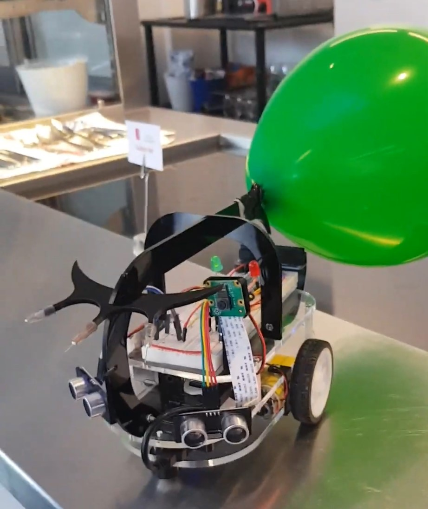

# Eirinn's robot (bootcamp 2019)

The camera code (balloon detection) is in `camera_server.py`. Run it first.

The state machine is in `main.py` and it connects to the camera server using [ZeroMQ](https://zeromq.org/), a simple system for inter-process communication. Using this method the camera code runs independent of the main robot code.

Once both python scripts are running, press the button on the robot to switch him into "patrol" mode.

